# About Me

Thank you for taking the time to view my portfolio. Rather than listing my skills, I wanted to showcase them.
I am currently completing a **Master's in Bioinformatics** at the **University of Birmingham**, with exams finishing in May 2025 and thesis submission in **August 2025**. Over the past four years, I have developed valuable skills that I am excited to apply to real-world research, including data processing, data visualisation, machine learning, NGS analysis, multi-omics integration, and statistical analysis. Below you will be able to see projects I have completed in the past year and evidence of the skills I have gained in the process.

**Skills Overview**

- **Programming Languages**: Python, R, Linux (Bash)
- **NGS Sequencing Analysis & Pipelines**: Variant calling, RNA-Seq analysis, FastQC, Trimmomatic, Alignment (BWA) and differential expression analysis (DESeq2, EdgeR)
- **Tools**: GATK, Bioconductor, DESeq2, Samtools, STAR, BEDTools
- **Machine Learning (Python)**: sckit-learn, XGBoost, Data Pre-processing, Unsupervised (K-means & Hierarchical Clustering), Supervised (KNN, Logistic Regression, SVM & Random Forest), Feature Reduction and Predictive modelling.
- **Data Visualisation**: ggplot2, Shiny
- **Data Processing**: Quality Control (FastQC), data normalisation and preprocessing
- **Data Analytics**: Statistical modelling, hypothesis testing
- **Statistical Analysis**: R & Python

# MSc Grade Transcript
```{r, echo=FALSE, warning=FALSE}
library(gt)
```

```{r, collapse=TRUE}

data <- data.frame(
  Module = c("Essentials of Mathematics & Statistics", 
             "Genomics & NGS", 
             "Data Analytics & Statistical Machine Learning", 
             "Metabolomics and Advanced (omics) Technologies", 
             "Computational Biology for Complex Systems"),
  Assignment = c("Individual Coursework", "Group Presentation", "Group Assignment", "Essay", "Group Presentation"),
  Grade = c('71.00%', '74.50%', '81.00%', '78.00%', '75.00%')
)

data %>%
  gt() %>%
  tab_header(
    title = md("<b>Grade Transcript</b>")  
  ) %>%
  cols_label(
    Module = md("<b>Module</b>"),  
    Assignment = md("<b>Assignment</b>"),  
    Grade = md("<b>Grade</b>")  
  ) %>%
  tab_style(
    style = list(
      cell_text(weight = "bold", color = "darkblue")  
    ),
    locations = cells_column_labels(columns = everything())  
  )

```


# Technical Experience

## NEXT GENERATION SEQUENCING DATA  ANALYSIS 

### VCF Trio Analysis for De Novo Variant Detection

During my **Genomics and Next Generation Sequencing module**, I completed a **VCF Trio Project** using **Python**, where I pre-processed sequencing data, analysed variant calls, and identified de novo mutations, including explaining the mutation biologically utilising **VEP** (Variant Effect Predictor). 
I achieved a mark of **74.5%**, which was over 10% above the module average.

**Skills Gained**:  

- **Summarised the VCF file**  

- **Preprocessed the VCF file**  
  - Removing data not associated with our Trio  
  - Removing low-quality reads  
  - Removing reads with low coverage  
  
- **Identified the child sample through**  
  - Filtered the VCF header and extracted chromosome and position 
  - Created a loop starting from first to the last sample 
  - Split each sample by colon (:) and extracted the genotype  
  - Printed a string with chromosome, position, and genotype (0/0, 0/1, or 1/1)  
  - Used the genotype patterns to determine which sample was the child  
  
- **Utilised VEP to interpret the mutation biologically**


<div style="display: flex; flex-wrap: wrap; justify-content: center;">

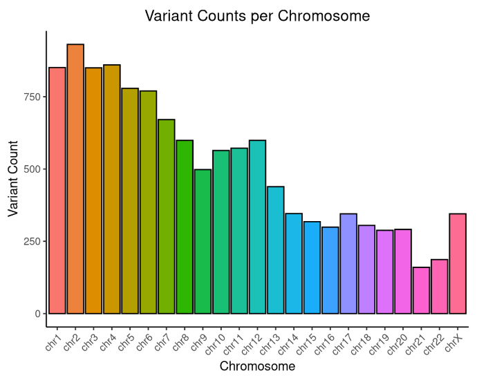
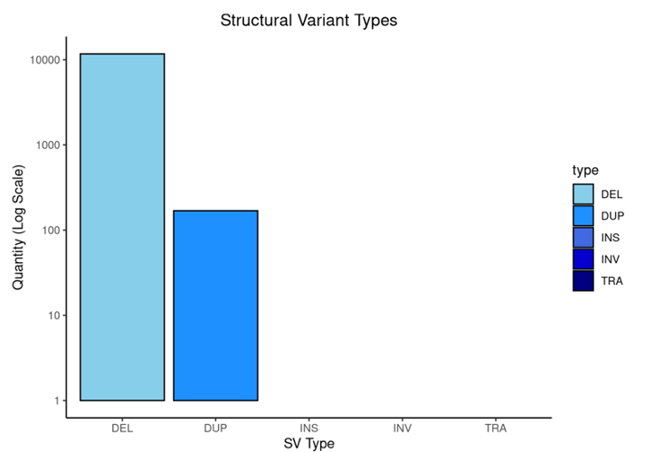
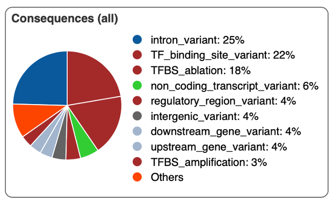
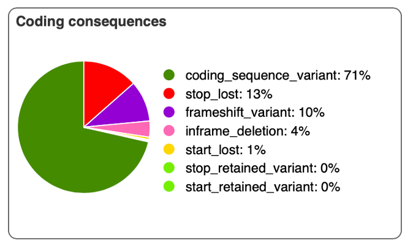

</div>

**Figure 1. VCF Summary.**

**Varaint Counts per Chromosome** demonstrating the distribution of variants across the genome. **Structural Variant Types** highlighting the type of variants that was present in the VCF file. **Consequences (All)** demonstrates the consequences of the variants, the location of the mutations. **Coding Consequences** showing the variants affecting the coding regions.

### NGS: Transcriptomic Analysis
During my Transcriptomic and RNA-seq project, I utilised R and Bash/Terminal, I conducted a comprehensive analysis involving quality control, data preprocessing, alignment, differential expression analysis and gene enrichment to reveal insights into plant's response to cold stress.


**Skills Gained**:  

- **Quality Control: FastQC**: assessed RNA-Seq raw data quality

- **Trimming and Filtering: Trimmomatic** removed low-quality reads and adapter contamination.  

- **Alignment**: Aligned reads to a reference genome using **hisat2**.Processed files with **Samtools**.

- **Gene Expression Analysis**: Generated a count matrix with **HTSeq-count**,Analysed data in **R**.  

- **PCA**: Normalised data with **DESeq2**. Visualised gene expression patterns using **ggplot2**.  

- **DEG Analysis**: Performed **DESeq2** analysis for differential gene expression across multiple conditions.  

- **Gene ID Conversion**: Converted **Faba Bean** to **Soybean Gene IDs** using **Ensembl Plant Biomart**.  

- **Gene Enrichment**: Conducted gene enrichment analysis with **gprofiler** and **Gene Ontology** to identify cold tolerance pathways.  

<div style="display: flex; flex-wrap: wrap; justify-content: center;">

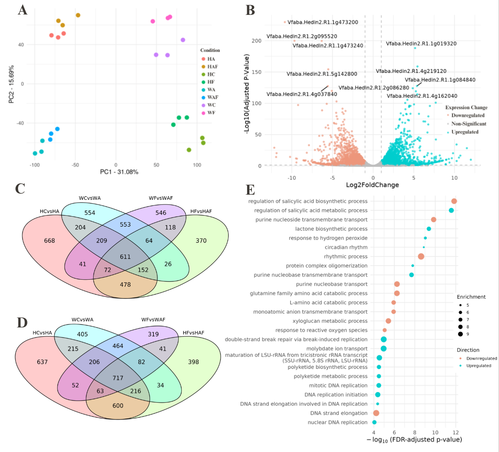

</div>

**Figure 2. Transcriptomic Response to Cold Stress.**
A. PCA demonstrating grouping between different sample conditions. B. Volcano plot to show differential gene expression between conditions. C-D. Venn diagram showing shared DEGs. E. Gene ontology analysis to show top enriched pathways.

## MACHINE LEARNING (PYTHON)
During this project, I worked with FPKM gene expression data to evaluate and compare the performance of different machine learning models to predict clinical outcomes. 
**Key Skills Gained:**

- **Data Preprocessing & Feature Selection**: Encoded categorical variables, scaled features, cleaned and standardised datasets, transposed and merged expression data and selected top genes using random forest and grid search.

- **Unsuprvised Learning**: Hierarchical Clustering & K-Means Clustering

- **Supervised Learning**: KNN, Logistic Regression, SVM and Random Forest.

- Assessed and compared the predictive performance of the models using performance matrics like **confusion matrix** and **ROC curves**.

<div style="display: flex; flex-wrap: wrap; justify-content: center;">

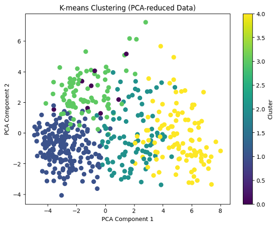
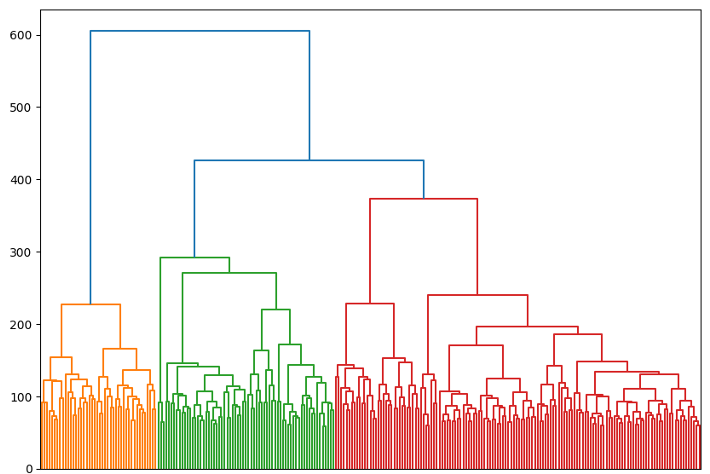
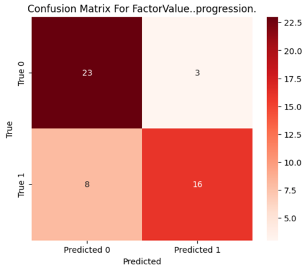
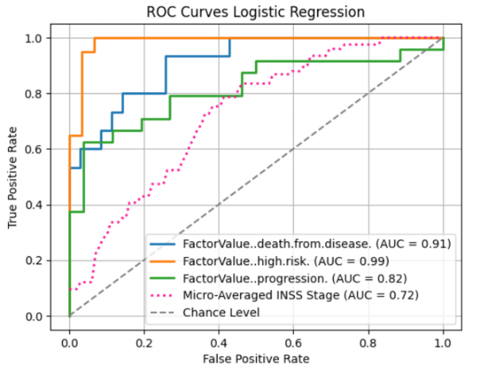

</div>

**Figure 3. Machine Learning Analysis and Model Evaluation**
Unsupervised machine learning to group patient samples based on transcriptomic data. The confusion matrix and ROC curve demonstrates the predictive performance of the models. 


## STATISTICAL ANALYSIS
**Multi-omics Integration**

During the **Computational Biology module**, I integrated **Transcriptomic** and **Metabolomic** data using **MOFA** and **SGCCA** to explore how D.Magna responds to chemical exposure across different locations of a lake, along with 1x, 10x concentration and control sample. This allowed me to enhance my skills in **multi-omics analysis**, dimensionality reduction and visualising biological patterns using unsupervised machine learning.


**Key Skills Gained:**

- Integrated **transcriptomic and metabolomic data**
- **MOFA** and **SGCCA**
- Interpreted factor plots and PCA to explore variation and clustering
- Linked molecular patterns to potential ecological impacts on Daphnia

<div style="display: flex; flex-wrap: wrap; justify-content: center;">

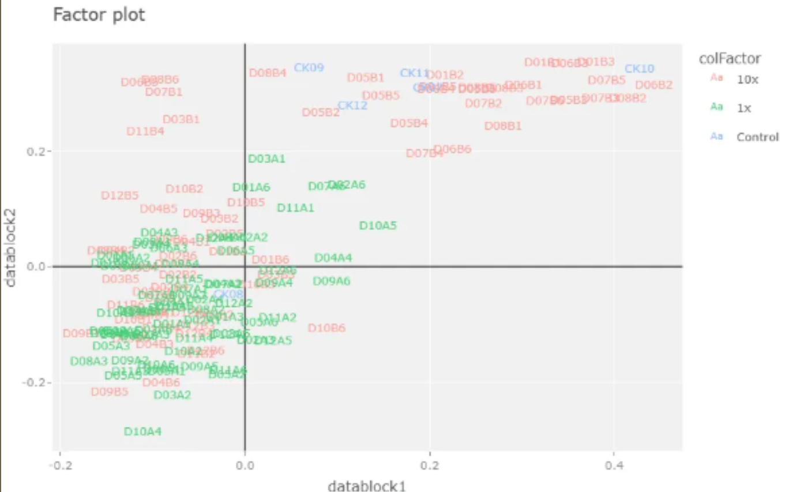
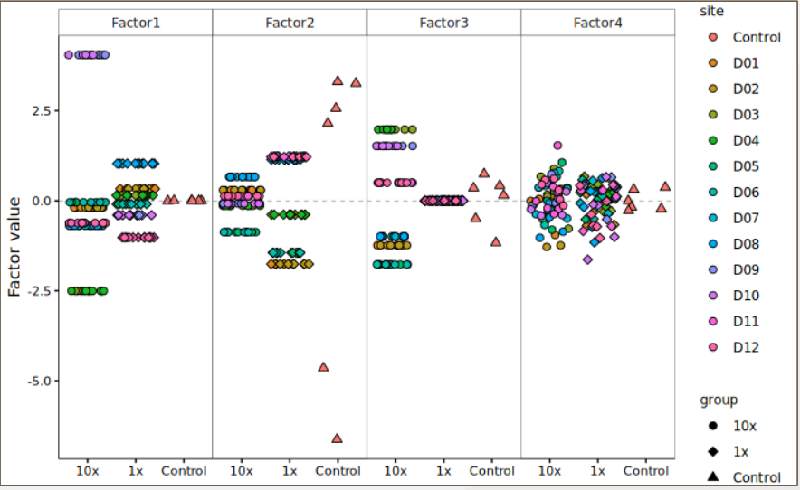
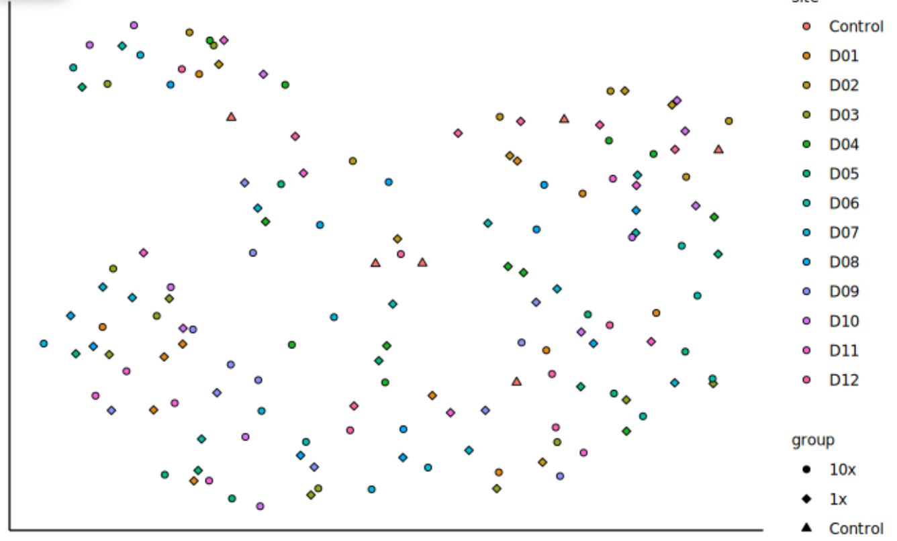
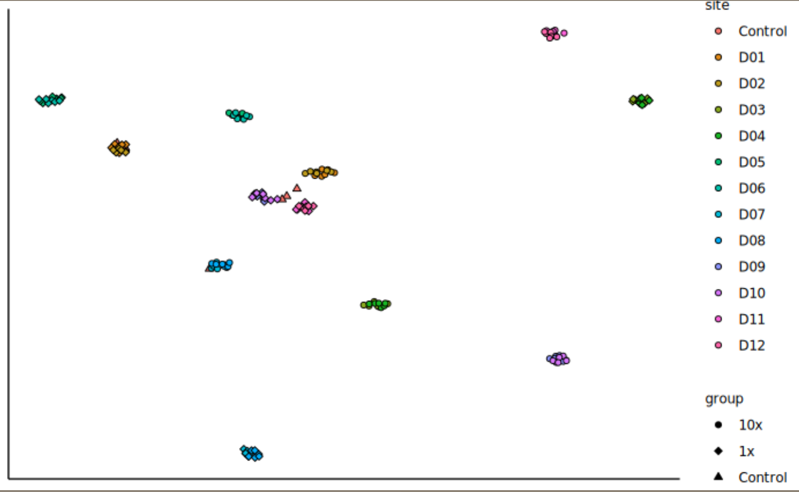

</div>

**Figure 4. Multivariate Analysis.**
Factor plot from SGCCA (left) and MOFA (right) showing treatment groups (control, 1x, 10x) and lake locations. PCA plots before and after feature reduction, highlighting sample grouping by treatment and location.

